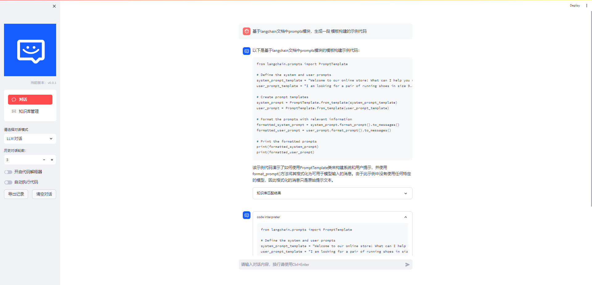
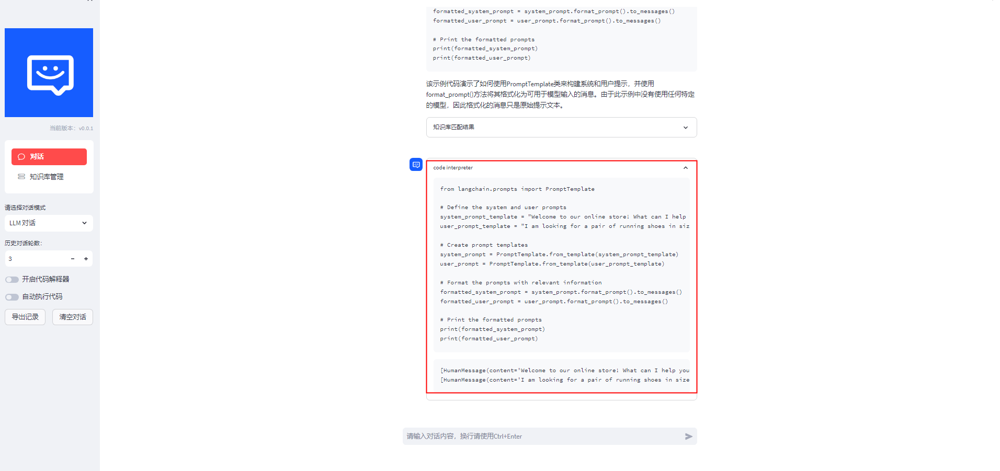
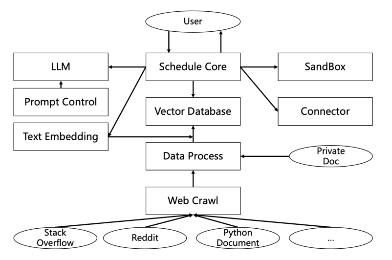

# <p align="center">DevOps-ChatBot</p>

<p align="center">
    <a href="README_en.md"></a>
    <a href="README.md"></a>
    
    <br><br>
</p>


# 更新
- [2023.09.15] ...

<br>
<br>
<br>


# 介绍

💡 本项目受langchain-chatchat项目和code-interpreter的启发，目标希望通过RAG、tool-learning和独立的沙盒环境来构建运维领域的对话机器人，让运维没有开发。


🤖️ DevOps-ChatBot是一个开箱即用的应用部署，面向私有化部署等场景诉求，只需提供私人文档或者各种运维领域的开源问答，即可替代stackoverflow等运维问答网站，来改变人的问题排查习惯，逐渐从各种资料查询 -> 大模型问答。

- 快速检索开源项目的技术文档
- 提供正确可执行的代码示例
- 支撑工具链路的自动执行


✅ 依托于开源的 LLM 与 Embedding 模型，本项目可实现全部使用开源模型离线私有部署。与此同时，本项目也支持 OpenAI GPT API 的调用。


# 使用实例
- 增加独立的沙盒环境
- 提供代码可编辑能力




# 技术路线



从下往上简介

● Web Crawl：定期网络文档爬取，保障数据时效性（依赖开源的持续补充）
● Data Process：针对不同爬取来源的数据，清洗、去重、分类，同时支持私有文档导入
● Vector Database：结合Text Embedding模型获取文档Embedding并存储（Milvus）
● Schedule Core：调度核心，负责LLM、Vector Database等的交互调度（Langchain）
● Prompt Control：面向开发、运维视角，不同问题分类，Prompt背景添加，保障回答的可控性、完备性
● LLM：一期采用GPT-4，后续面向私有部署等隐私性场景，提供专有模型
● Text Embedding：一期采用OpenAI Text Embedding模型，后续面向私有部署等隐私性场景，提供专有模型
● SandBox：针对生成的结果，比如代码，用户不确定真假，提供环境交互验证（FaaS），支持修改
● Connector：后续和周边平台通过API打通，比如监控等平台，方便交互以及操作（重启）


# 开发部署

请自行安装nvidia驱动程序，本项目已在 Python 3.9.18，CUDA 11.7 环境下完成测试。已在 Windows 系统中完成测试。

1、开发环境准备

```bash
# 准备conda环境
conda create --name devopsgpt python=3.9
conda activate devopsgpt
```

```bash
# 安装相关依赖包
pip install -r requirements.txt
```


2. 下载模型至本地

如需使用开源 LLM 与 Embedding 模型可以从 HuggingFace 下载。

以本项目中默认使用的 LLM 模型 THUDM/chatglm2-6b 与 Embedding 模型 moka-ai/m3e-base 为例：

下载模型需要先安装Git LFS，然后运行
```
git lfs install
git lfs clone https://huggingface.co/shibing624/text2vec-base-chinese
```
<br>

3、沙箱环境准备
- windows docker 安装
[Docker Desktop for Windows](https://docs.docker.com/desktop/install/windows-install/) 支持 64 位版本的 Windows 10 Pro，且必须开启 Hyper-V（若版本为 v1903 及以上则无需开启 Hyper-V），或者 64 位版本的 Windows 10 Home v1903 及以上版本。

  - [【全面详细】Windows10 Docker安装详细教程](https://zhuanlan.zhihu.com/p/441965046)
  - [Docker 从入门到实践](https://yeasy.gitbook.io/docker_practice/install/windows)
  - [Docker Desktop requires the Server service to be enabled 处理](https://blog.csdn.net/sunhy_csdn/article/details/106526991)
  - [安装wsl或者等报错提示](https://learn.microsoft.com/zh-cn/windows/wsl/install)
<br>

- linux docker 安装
linux安装相对比较简单，请自行baidu/google相关安装

- mac docker 安装
  - [Docker 从入门到实践](https://yeasy.gitbook.io/docker_practice/install/mac)
<br>

4、一键启动服务

```bash
cd examples
bash start_webui.py
```


## Licenses
