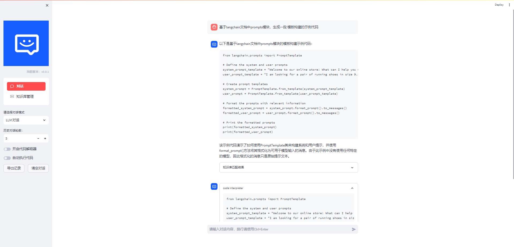
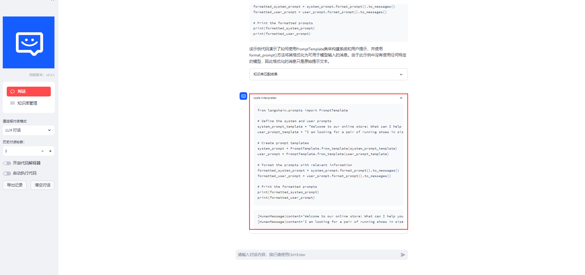
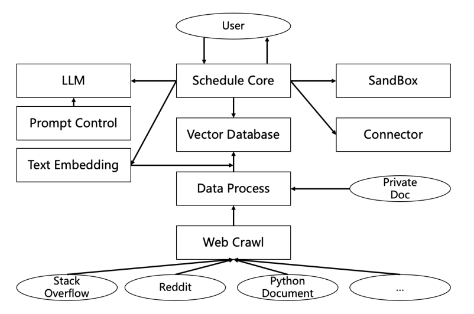

# <p align="center">DevOps-ChatBot</p>

<p align="center">
    <a href="README_en.md"></a>
    <a href="README.md"></a>
    
</p>


# News
- [2023.09.15] ...

<br>
<br>
<br>


# Introduction

💡 This project is inspired by the [langchain-chatchat](https://github.com/chatchat-space/Langchain-Chatchat) project and code interpreter, aiming to build an operations-oriented conversational AI using RAG, tool learning, and an independent sandbox environment, so that operations personnel can perform tasks without the need for development.


🤖️ DevOps-ChatBot is a plug-and-play application deployment designed for scenarios such as private deployment. It replaces traditional operations and maintenance Q&A websites like Stack Overflow by providing personalized documentation or open-source question-and-answer resources in the operations domain. The goal is to change the habit of troubleshooting by gradually shifting from searching various references to utilizing a large-scale model for question answering.

- Knowledge base management: Implement open-source or private technical document quick search in conversations.
- Code extraction: Provide correct and executable code examples.
- Isolated sandbox environment: Enable self-iterative repair of code examples.
- React paradigm: Support automatic execution of toolchain routes.
- Prompt management: Implement various development and operations tasks.
- Conversation-driven: Automatically query documents and generate code.


🌍 Based on open-source LLM and Embedding models, this project enables offline private deployment using solely the open-source models. Meanwhile, it also supports invoking the OpenAI GPT API for usage.

🤗 Based on [langchain-chatchat](https://github.com/chatchat-space/Langchain-Chatchat) and [codebox-api](https://github.com/shroominic/codebox-api) to further implement the functionality we need, thanks for their open-source work!!!


# Usage Example
- Incorporate an independent sandbox environment.
- Provide code editing capabilities.





# Tech RoadMap



from bottom to up

- Web Crawl: Regularly crawl web documents to ensure data timeliness (dependent on open-source continuous updates).
- Data Process: Clean, deduplicate, and categorize data from different crawling sources, while also supporting private document imports.
- Vector Database: Utilize Text Embedding models to obtain document embeddings and store them (using Milvus).
- Schedule Core: Responsible for the interaction and scheduling of components such as LLM (Language Model), Vector Database, etc. (using Langchain).
- Prompt Control: Categorize different types of questions from a developer and operations perspective, add prompt context to ensure controllability and completeness of answers.
LLM: Initially using GPT-4, with plans to provide proprietary models for scenarios such as private deployments with privacy concerns.
- Text Embedding: Initially using OpenAI Text Embedding model, with plans to provide proprietary models for scenarios such as private deployments with privacy concerns.
- SandBox: For generated results, such as code, provide interactive verification in an environment (FaaS) to allow users to validate and modify if uncertain about authenticity.
- Connector: API integration with peripheral platforms in the future, such as monitoring platforms, to facilitate interaction and operations (e.g., restarts).
<br>

- [ ] Sandbox 环境
  - [x] 环境隔离的sandbox环境与代码执行
  - [ ] 上传、下载文件
- [ ] Vector Database
  - [ ] task retrieval
  - [ ] tool retrieval
- [ ] Schedule Core
  - [ ] 基于langchain的react模式
- [ ] Prompt Control
  - [ ] 基于不同prompt管理不同任务
- [x] 基于fastchat接入LLM
- [x] 基于sentencebert接入Text Embedding
  - [ ] 向量加载速度提升
- [ ] Connector
- [ ] Web Crawl
  - [ ] 技术文档、issue document、SDK Library Document
- [ ] Data Process 基础能力

# Dev Deploy

Please install the NVIDIA driver on your own. This project has been tested on Python 3.9.18 and CUDA 11.7 environment. The testing has been conducted on the Windows operating system.

1、prepare dev environment 

```bash
# 准备conda环境
conda create --name devopsgpt python=3.9
conda activate devopsgpt
```

```bash
# 安装相关依赖包
pip install -r requirements.txt
```


2. download LLM/Embedding models from huggingface

To download open-source LLM (Language Model) and Embedding models from HuggingFace, follow these steps:

To download the default LLM model, THUDM/chatglm2-6b, used in this project, you need to install Git LFS and then run the following commands:

Please install Git LFS first before running the download.
```bash
git lfs install
git lfs clone https://huggingface.co/THUDM/chatglm2-6b
```
<br>

3、prepare sandbox environment
- windows docker install 
[Docker Desktop for Windows](https://docs.docker.com/desktop/install/windows-install/) supports 64-bit versions of Windows 10 Pro and must have Hyper-V enabled (if the version is v1903 or above, Hyper-V is not required), or 64-bit versions of Windows 10 Home v1903 or above.

  - [Install Docker Desktop on Windows](https://docs.docker.com/desktop/install/windows-install/)
  - [Error: Docker Desktop requires the Server service to be enabled](https://blog.csdn.net/sunhy_csdn/article/details/106526991)
  - [install WSL](https://learn.microsoft.com/zh-cn/windows/wsl/install)
<br>

- linux docker install
  - [Install Docker Desktop on Linux](https://docs.docker.com/desktop/install/linux-install/)

- mac docker install
  - [Install Docker Desktop on Mac](https://docs.docker.com/desktop/install/mac-install/)

  
<br>

- mac docker install
comming soon

4、service activation

```bash
cd examples
bash start_webui.sh
```


## Licenses
